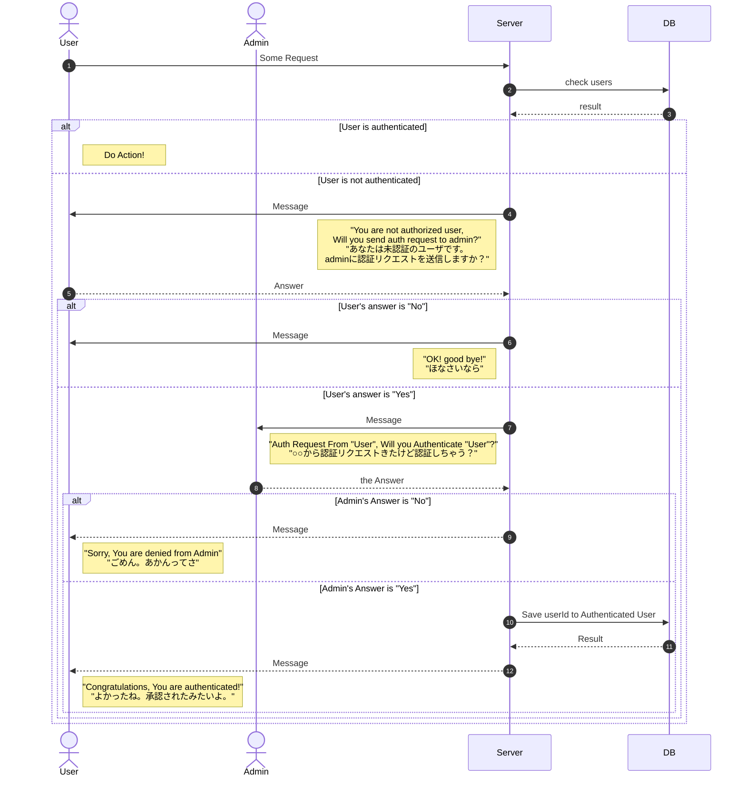

# baby_channel
## Summary
LINE bot for RaspberryPi.

### Function
#### 写真撮影（take photo）
If you send the message "写真撮影" to LINE bot, take a photo and post it to the talk.

#### 温湿度計測（Temperature and humidity measurement）
When "写真撮影", Notifies the current temperature and humidity after 写真撮影.

#### 認証（Authorization）　Unimplemented
When new User Follow this bot, ask to admin want to be approve.



## Install

- install SqLite
  - see [this Article](https://nekonisi.com/install_sqlite/)
  - or execute below command(Debian系)
  ```bash
  sudo apt install sqlite3 -y
  ```

- expand submodule

```
cd nekonisi_dht11;
git submodule update -i;
```
- install pip library
```
pip install -r requirements.txt
```

```
export LINE_CHANNEL_SECRET="{LINE_CHANNEL_SECRET}"
export LINE_CHANNEL_ACCESS_TOKEN="{LINE_CHANNEL_ACCESS_TOKEN}"
export LINE_ADMIN_USER_ID="{LINE_ADMIN_USER_ID}"
```

## execute

```
python app.php
```